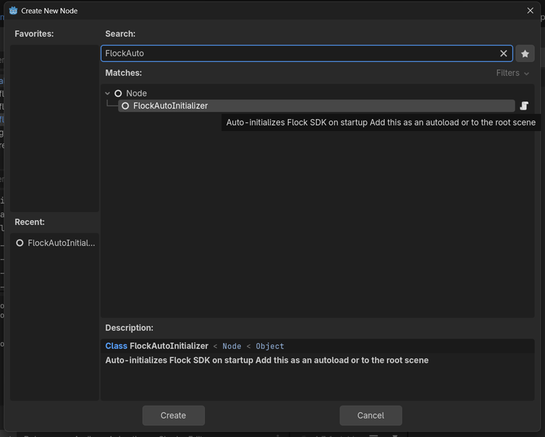

# Unofficial Qwacks Godot SDK

A pure GDScript implementation of the [Qwacks](https://qwacks.com) game backend SDK for **Godot 4.x**.

> **Version 1.37.0** — Ported from the official C# Unity SDK.

[](https://godotengine.org)
[](LICENSE)
[](https://unofficial-qwacks-godot-sdk.github.io/qwacks-godot-sdk/)

---

## What is this?

This SDK connects your Godot game to the [Qwacks](https://qwacks.com) backend platform, providing:

- **Authentication** — Email, Device, Google, Apple, Steam, Facebook, Discord, account linking
- **Player Data** — CRUD operations on player templates with offline caching
- **Game Config** — Remote configuration with live patching
- **Shop** — In-game shop with item purchases, rewards, inventory, and consumption
- **Assets** — Remote asset management with local caching
- **Commands** — Player data updates, currency, achievements, offline write queue
- **Leaderboards** — Global/windowed standings, ranks, and player neighborhoods by board name
- **Notifications** — In-app mailbox, unread badge, templates, and scheduled notifications
- **Analytics** — Session tracking, events, transactions, error logging, consent management
- **Offline Support** — Automatic caching and durable write queuing when offline

## Quick Setup

### 1. Install the plugin

Copy the `addons/flock_sdk/` folder into your Godot project:

```
your-project/
├── addons/
│   └── flock_sdk/
│       ├── plugin.cfg
│       ├── plugin.gd
│       ├── core/
│       ├── auth/
│       ├── providers/
│       ├── models/
│       ├── http/
│       ├── analytics/
│       ├── bootstrap/
│       ├── config/
│       ├── logging/
│       ├── exceptions/
│       └── sample/
└── project.godot
```

### 2. Enable the plugin

In Godot Editor: **Project → Project Settings → Plugins → Enable "Qwacks SDK"**

### 3. Add the Auto-Initializer

Add a `FlockAutoInitializer` node to your root scene:



Then configure it in the Inspector:


Or add it via code:

```gdscript
# In your main scene or autoload
func _ready():
    var flock = FlockAutoInitializer.new()
    flock.game_id = "YOUR_GAME_ID"
    flock.game_version_id = "YOUR_VERSION_ID"
    flock.api_key = "YOUR_API_KEY"
    add_child(flock)
```

### 4. Connect to events

```gdscript
FlockEvents.get_instance().initialized.connect(func():
    print("SDK Ready!")
    # Start using the SDK
)

FlockEvents.get_instance().authenticated.connect(func(info: Dictionary):
    print("Player: ", info["player_id"])
)
```

### 5. Login

```gdscript
var result = await FlockClient.get_instance().auth.login_with_device()
if result is Dictionary and not result.has("error"):
    print("Logged in!")
```

## Testing

The SDK repo ships with unit tests and a real-credentials integration pipeline.

### One-time import

First-time only — registers the SDK/GUT scripts so `class_name` globals resolve:

```
godot --headless --path . --import
```

### Unit tests (GUT)

Runs all unit tests headless and exits `0` on success (gives a non-zero code on failure):

```
godot --headless -s addons/gut/gut_cmdln.gd -gdir=res://tests/ -gexit
```

The bundled [GUT](https://gut.readthedocs.io/en/v9.7.1/) addon (`addons/gut/`) targets Godot 4.7.x. Unit tests live under `res://tests/unit/` and cover models, error hints/hints composition, the offline command classifier, event cache, snapshot store, pending writes, session snapshots, logger severity, and SDK version consistency. Integration scripts are discovered too but stay `PENDING` until credentials are configured, so the command above passes in CI.

### Real-credentials integration pipeline

A dedicated runner (not a GUT test) that exercises the SDK against the live backend in a strict `CREATE → UPDATE → DELETE` order and, before running, verifies every template/member the configured phases need — printing exact setup instructions for anything missing:

```
godot --headless -s res://tests/integration/run_pipeline.gd
```

Provide credentials via environment variables:

```
FLOCK_GAME_ID=... FLOCK_GAME_VERSION_ID=... FLOCK_API_KEY=... godot --headless -s res://tests/integration/run_pipeline.gd
```

or copy `tests/integration/secrets.cfg.example` to `tests/integration/secrets.cfg` (gitignored) and fill it in.

The pipeline is driven by the `[pipeline]` section: `run_phases` selects which phases to run (`device,currency` by default; optional `achievement`, `notification`, `shop`, `leaderboard`, `game_config`), and each phase's template names/members are declared there. The INFRA step checks each one on the backend and, when something is missing, lists exactly what to create (e.g. "currency template exists but is missing fields ['gold']"). Exit codes: `0` all passed, `1` runtime failure, `2` credentials missing, `3` prerequisites missing. See `tests/integration/secrets.cfg.example` for the full field-by-field checklist.

## Documentation

Full documentation is available at: **[unofficial-qwacks-godot-sdk.github.io/qwacks-godot-sdk](https://unofficial-qwacks-godot-sdk.github.io/qwacks-godot-sdk/)**

- [Getting Started](docs/guide/getting-started.md)
- [Installation](docs/guide/installation.md)
- [Configuration](docs/guide/configuration.md)
- [Authentication](docs/providers/authentication.md)
- [Player Data](docs/providers/player-data.md)
- [Game Config](docs/providers/game-config.md)
- [Shop](docs/providers/shop.md)
- [Assets](docs/providers/assets.md)
- [Commands](docs/providers/commands.md)
- [Analytics](docs/providers/analytics.md)
- [Events System](docs/events.md)
- [Error Handling](docs/error-handling.md)
- [Offline Support](docs/offline-support.md)
- [API Reference](docs/api-reference.md)
- [Migration from C#](docs/migration.md)

## Requirements

- **Godot 4.2+** (tested on 4.7.1)
- **Internet connection** for backend calls
- A [Qwacks](https://qwacks.com) game account with API key and Game Version ID

## License

MIT — See [LICENSE](LICENSE) for details.

> **Disclaimer:** This is an unofficial community port. Not affiliated with Qwacks.
