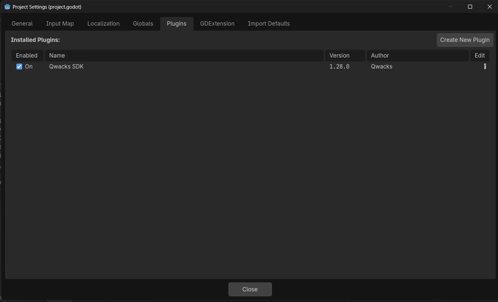
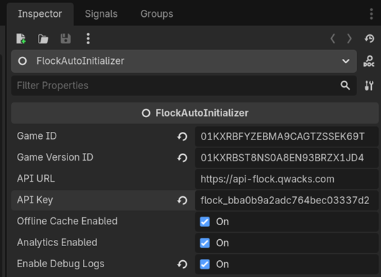

# Installation

## Prerequisites

- **Godot 4.2+** (tested on 4.7.1 stable)
- A [Qwacks](https://qwacks.com) game account with:
  - Game ID
  - Game Version ID
  - API Key

## Install the Plugin

### Option 1: Copy the addon folder

Copy the entire `addons/flock_sdk/` directory into your Godot project:

```
your-project/
├── addons/
│   └── flock_sdk/          ← Copy this entire folder
│       ├── plugin.cfg
│       ├── plugin.gd
│       ├── core/
│       ├── auth/
│       ├── providers/
│       ├── models/
│       ├── http/
│       ├── analytics/
│       ├── bootstrap/
│       ├── config/
│       ├── logging/
│       ├── exceptions/
│       └── sample/
└── project.godot
```

### Option 2: Clone the repository

```bash
cd your-project/addons
git clone https://github.com/unofficial-qwacks-godot-sdk/qwacks-godot-sdk.git flock_sdk
```

## Enable the Plugin

1. Open your project in Godot Editor
2. Go to **Project → Project Settings → Plugins** tab
3. Find **"Qwacks SDK"** in the list
4. Check the **Enabled** checkbox



> **Important:** After enabling, a `FlockRuntimeSetup` autoload is automatically registered. This creates the `FlockClient` and `FlockEvents` singletons at runtime.

## Set Up the Auto-Initializer

### Option A: Inspector (Recommended)

1. Open your main scene (e.g., `main.tscn`)
2. Add a new node → search for `Node` → rename it to `FlockAutoInitializer`
3. In the Inspector, set:
   - **Game ID**: Your game ID from Qwacks
   - **Game Version ID**: Your version ID
   - **Api Key**: Your API key
   - **Api Url**: `https://api-flock.qwacks.com` (default)



### Option B: Code

```gdscript
# In your main scene's _ready()
func _ready():
    var flock = FlockAutoInitializer.new()
    flock.name = "FlockAutoInitializer"
    flock.game_id = "YOUR_GAME_ID"
    flock.game_version_id = "YOUR_VERSION_ID"
    flock.api_key = "YOUR_API_KEY"
    flock.api_url = "https://api-flock.qwacks.com"
    flock.enable_debug_logs = true  # Optional: enable debug logging
    add_child(flock)
```

### Option C: Manual Initialization (Advanced)

If you need full control over initialization:

```gdscript
func _ready():
    var config = FlockInitConfig.new()
    config.game_id = "YOUR_GAME_ID"
    config.game_version_id = "YOUR_VERSION_ID"
    config.api_key = "YOUR_API_KEY"
    config.api_url = "https://api-flock.qwacks.com"
    config.enable_debug_logs = true
    config.enable_offline_cache = true
    config.analytics_config = {
        "enabled": true,
        "auto_start_session": true,
    }
    
    FlockClient.get_instance().create(config)
```

> **Note:** If using manual initialization, skip the `FlockAutoInitializer` node — they conflict.

## Verify Installation

Add this script to any node to verify the SDK is working:

```gdscript
extends Node

func _ready():
    FlockEvents.get_instance().initialized.connect(func():
        print("Qwacks SDK initialized!")
        print("Player ID: ", FlockClient.get_instance().current_player_id)
    )
    
    FlockEvents.get_instance().initialization_failed.connect(func(error: String):
        print("SDK failed: ", error)
    )
```

If you see "Qwacks SDK initialized!" in the output panel, you're good to go!

## Project Structure

After installation, your project will have these key components:

```
addons/flock_sdk/
├── plugin.cfg                  # Plugin manifest
├── plugin.gd                   # Registers FlockRuntimeSetup autoload
├── core/
│   ├── flock_client.gd         # Main SDK singleton (FlockClient)
│   ├── flock_events.gd         # Event hub singleton (FlockEvents)
│   ├── flock_init_config.gd    # Configuration data class
│   ├── flock_runtime_setup.gd  # Creates singletons at runtime
│   ├── flock_config.gd         # Internal config helpers
│   ├── flock_util.gd           # File system utilities
│   └── flock_uuid.gd           # UUID generation
├── auth/
│   ├── flock_auth_provider.gd  # All authentication methods
│   ├── jwt_token_parser.gd     # JWT token decoding
│   └── token_store/            # Token persistence
├── providers/
│   ├── flock_player_provider.gd    # Player data CRUD
│   ├── flock_config_provider.gd    # Game config/patches
│   ├── flock_game_provider.gd      # Game & version info
│   ├── flock_shop_provider.gd      # Shop & inventory
│   ├── flock_asset_provider.gd     # Asset management
│   └── flock_command_provider.gd   # Write commands (offline queue)
├── models/                     # Data transfer objects
├── http/                       # HTTP client, endpoints, retry
├── analytics/                  # Session, events, consent
├── bootstrap/                  # FlockAutoInitializer
├── config/                     # ConfigFile resource
├── logging/                    # Logger implementations
├── exceptions/                 # Error types
└── sample/                     # Quick Start & All Features demos
```

## Next Steps

- [Quick Start](quick-start.md) — Get running in 5 minutes
- [Configuration](configuration.md) — All configuration options
- [Authentication](../providers/authentication.md) — Login methods
